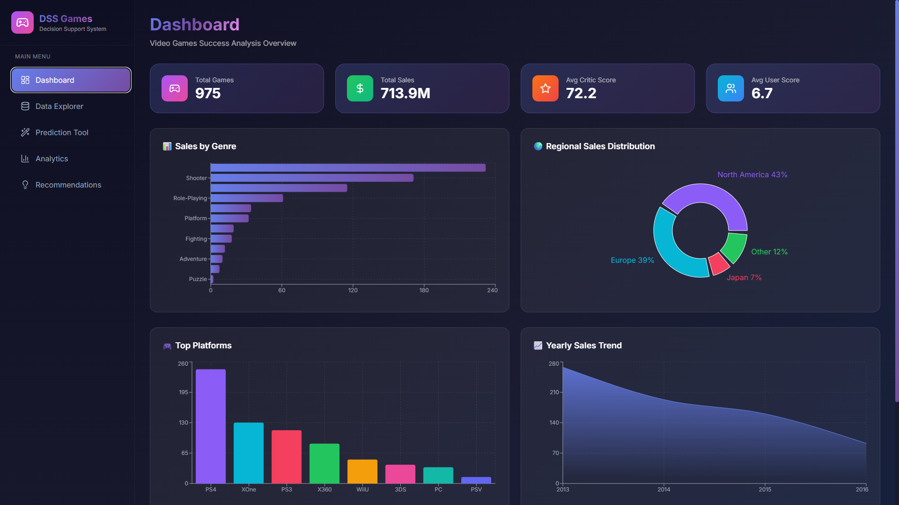
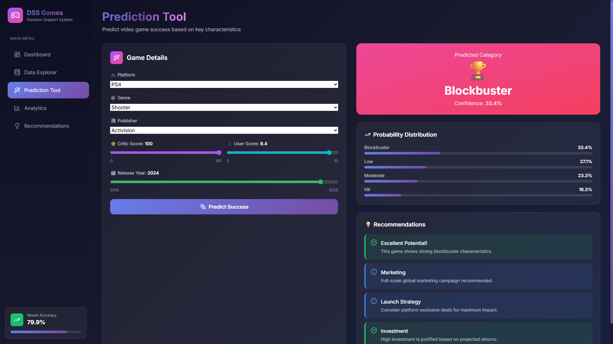
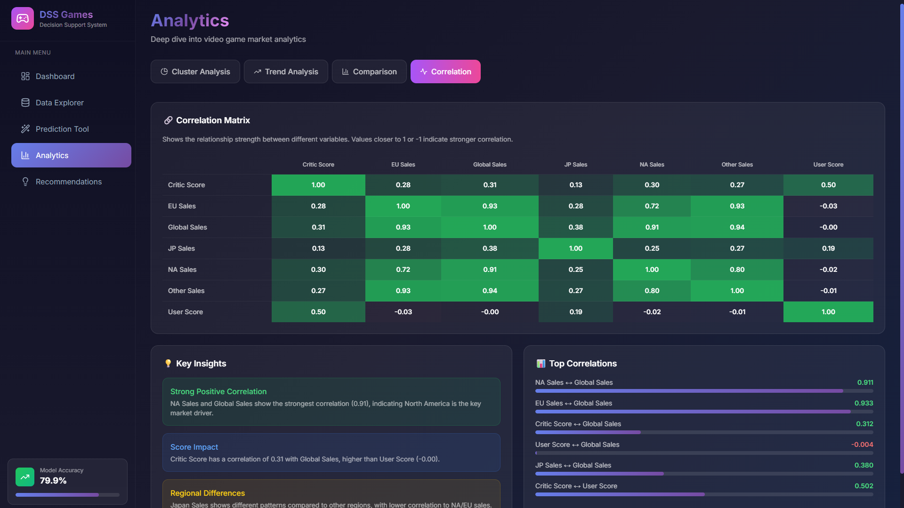

# 🎮 Decision Support System - Video Games Success Prediction


Sistem Pendukung Keputusan (DSS) untuk memprediksi kesuksesan video game berdasarkan analisis data historis penjualan. Aplikasi ini menggunakan Machine Learning (Random Forest & K-Means Clustering) untuk memberikan prediksi dan rekomendasi strategis.

## 🌐 Live Demo

- **Frontend (Vercel)**: [https://your-app.vercel.app](https://your-app.vercel.app)
- **Backend API (Render)**: [https://your-api.onrender.com](https://your-api.onrender.com)



## 📋 Daftar Isi

- [Fitur](#-fitur)
- [Teknologi](#-teknologi)
- [Struktur Project](#-struktur-project)
- [Instalasi](#-instalasi)
- [Menjalankan Aplikasi](#-menjalankan-aplikasi)
- [API Endpoints](#-api-endpoints)
- [Dataset](#-dataset)
- [Model Machine Learning](#-model-machine-learning)
- [Screenshots](#-screenshots)
- [Kontributor](#-kontributor)

## ✨ Fitur

### 🎯 Dashboard
- Ringkasan statistik (total games, total sales, rata-rata score)
- Visualisasi penjualan berdasarkan genre dan platform
- Trend penjualan tahunan
- Top 10 games dengan penjualan tertinggi

### 🔍 Data Explorer
- Tabel data interaktif dengan pagination
- Filter berdasarkan platform, genre, dan pencarian nama
- Sorting berdasarkan kolom
- Export dan analisis data

### 🤖 Prediction Tool
- Prediksi kesuksesan game berdasarkan input:
  - Platform (PS4, XOne, PC, dll.)
  - Genre (Action, Sports, Shooter, dll.)
  - Publisher
  - Critic Score & User Score
  - Tahun Rilis
- Hasil prediksi dengan confidence level
- Rekomendasi strategis berdasarkan hasil prediksi

### 📊 Analytics
- **Cluster Analysis**: Visualisasi segmentasi game (Blockbuster, Hit, Mid-Tier, Low Performer)
- **Trend Analysis**: Analisis tren penjualan dan skor per tahun
- **Comparison**: Perbandingan performa genre dan platform
- **Correlation Matrix**: Hubungan antar variabel numerik

### 💡 Recommendations
- Strategic insights untuk publisher, developer, dan investor
- Association rules dari data mining (Apriori algorithm)
- Risk factors dan positive indicators

## 🛠 Teknologi

### Backend
- **Python 3.8+**
- **Flask** - REST API framework
- **Pandas** - Data manipulation
- **Scikit-learn** - Machine Learning
- **Joblib** - Model serialization

### Frontend
- **Next.js 14** - React framework
- **TypeScript** - Type safety
- **Tailwind CSS** - Styling
- **Recharts** - Data visualization
- **Lucide React** - Icons

### Machine Learning
- **Random Forest Classifier** - Prediksi kategori kesuksesan
- **K-Means Clustering** - Segmentasi game
- **Apriori Algorithm** - Association rules

## 📁 Struktur Project

```
decision-support-system-game/
├── 📂 backend/
│   ├── api.py              # Flask REST API
│   └── requirements.txt    # Python dependencies
│
├── 📂 frontend/
│   ├── 📂 src/
│   │   ├── 📂 app/
│   │   │   ├── globals.css    # Global styles
│   │   │   ├── layout.tsx     # Root layout
│   │   │   └── page.tsx       # Main page
│   │   └── 📂 components/
│   │       ├── Analytics.tsx      # Analytics page
│   │       ├── Dashboard.tsx      # Dashboard page
│   │       ├── DataExplorer.tsx   # Data explorer page
│   │       ├── PredictionTool.tsx # Prediction page
│   │       ├── Recommendations.tsx # Recommendations page
│   │       └── Sidebar.tsx        # Navigation sidebar
│   ├── package.json
│   ├── next.config.js
│   ├── tailwind.config.js
│   └── tsconfig.json
│
├── 📂 dataset/
│   ├── Video_Games.csv           # Raw dataset
│   ├── clean_data_video_games.csv # Cleaned dataset
│   ├── data_with_cluster.csv     # Dataset with cluster labels
│   └── rules_success_factors.csv # Association rules
│
├── 📂 models/
│   ├── rf_model.joblib      # Random Forest model
│   ├── kmeans.joblib        # K-Means model
│   ├── scaler.joblib        # StandardScaler
│   ├── le_platform.joblib   # Label Encoder (Platform)
│   ├── le_genre.joblib      # Label Encoder (Genre)
│   ├── le_publisher.joblib  # Label Encoder (Publisher)
│   ├── metadata.json        # Model metadata
│   ├── chart_data.json      # Pre-computed chart data
│   ├── cluster_data.json    # Cluster data
│   └── top_games.json       # Top games data
│
├── DSS_Video_Games_Analysis.ipynb  # Jupyter notebook analysis
├── app.py                          # Streamlit app (alternative)
└── README.md
```

## 🚀 Instalasi

### Prerequisites
- Python 3.8 atau lebih tinggi
- Node.js 18 atau lebih tinggi
- npm atau yarn

### 1. Clone Repository
```bash
git clone https://github.com/Hafizh220705/decision-support-system-game.git
cd decision-support-system-game
```

### 2. Setup Backend
```bash
# Masuk ke folder backend
cd backend

# (Opsional) Buat virtual environment
python -m venv venv

# Aktivasi virtual environment
# Windows:
venv\Scripts\activate
# Linux/Mac:
source venv/bin/activate

# Install dependencies
pip install -r requirements.txt
```

### 3. Setup Frontend
```bash
# Masuk ke folder frontend
cd frontend

# Install dependencies
npm install
# atau
yarn install
```

## ▶️ Menjalankan Aplikasi

### 1. Jalankan Backend API
```bash
# Dari folder backend
cd backend
python api.py
```
Backend akan berjalan di: `http://localhost:5000`

### 2. Jalankan Frontend
```bash
# Dari folder frontend (terminal baru)
cd frontend
npm run dev
# atau
yarn dev
```
Frontend akan berjalan di: `http://localhost:3000`

### 3. Buka Browser
Akses aplikasi di: **http://localhost:3000**

## 📡 API Endpoints

| Method | Endpoint | Deskripsi |
|--------|----------|-----------|
| GET | `/api/health` | Health check |
| GET | `/api/metadata` | Get model metadata |
| GET | `/api/games` | Get games dengan filter |
| GET | `/api/chart-data` | Get chart data |
| GET | `/api/cluster-data` | Get cluster visualization data |
| GET | `/api/top-games` | Get top games by sales |
| POST | `/api/predict` | Predict game success |
| GET | `/api/analytics/summary` | Get analytics summary |
| GET | `/api/analytics/genre` | Get genre analytics |
| GET | `/api/analytics/platform` | Get platform analytics |
| GET | `/api/analytics/yearly` | Get yearly analytics |
| GET | `/api/analytics/correlation` | Get correlation matrix |
| GET | `/api/analytics/rules` | Get association rules |

### Contoh Request Prediksi
```bash
curl -X POST http://localhost:5000/api/predict \
  -H "Content-Type: application/json" \
  -d '{
    "platform": "PS4",
    "genre": "Action",
    "publisher": "Electronic Arts",
    "critic_score": 85,
    "user_score": 8.0,
    "year": 2024
  }'
```

### Contoh Response
```json
{
  "success": true,
  "prediction": "Hit",
  "probabilities": {
    "Blockbuster": 0.15,
    "Hit": 0.45,
    "Moderate": 0.30,
    "Low": 0.10
  },
  "confidence": 0.45,
  "recommendations": [...]
}
```

## 📊 Dataset

Dataset yang digunakan adalah **Video Games Sales** yang berisi data penjualan video game dari berbagai platform.

### Statistik Dataset
| Metric | Value |
|--------|-------|
| Total Records (Raw) | 16,719 |
| Total Records (Clean) | 976 |
| Platforms | 8 |
| Genres | 12 |
| Publishers | 85 |
| Year Range | 2013 - 2016 |

### Kolom Dataset
- `Name` - Nama game
- `Platform` - Platform (PS4, XOne, PS3, X360, PC, WiiU, 3DS)
- `Year_of_Release` - Tahun rilis
- `Genre` - Genre game
- `Publisher` - Publisher game
- `NA_Sales` - Penjualan North America (juta unit)
- `EU_Sales` - Penjualan Europe (juta unit)
- `JP_Sales` - Penjualan Japan (juta unit)
- `Other_Sales` - Penjualan region lain (juta unit)
- `Global_Sales` - Total penjualan global (juta unit)
- `Critic_Score` - Skor kritikus (0-100)
- `User_Score` - Skor user (0-10)

## 🤖 Model Machine Learning

### 1. Random Forest Classifier
- **Akurasi**: ~79.9%
- **Target Classes**: Blockbuster, Hit, Moderate, Low
- **Features**: Platform, Genre, Publisher, Critic Score, User Score, Year

### 2. K-Means Clustering
- **Clusters**: 4
  - Cluster 0: Low Performer (Sales < 1M)
  - Cluster 1: Moderate Mid-Tier (Sales 1-2M)
  - Cluster 2: High Sales Hit (Sales 2-5M)
  - Cluster 3: Massive Blockbuster (Sales > 5M)

### 3. Association Rules (Apriori)
- Mengidentifikasi pola kesuksesan game
- Minimum Support: 1%
- Minimum Confidence: 10%

## 📸 Screenshots

### Dashboard


### Prediction Tool


### Analytics


## 🔧 Troubleshooting

### Backend tidak bisa start
```bash
# Pastikan semua dependencies terinstall
pip install flask flask-cors pandas numpy scikit-learn joblib

# Pastikan berada di folder yang benar
cd backend
python api.py
```

### Frontend error "Module not found"
```bash
# Hapus node_modules dan install ulang
cd frontend
rm -rf node_modules
npm install
```

### CORS Error
Pastikan backend sudah berjalan di port 5000 sebelum menjalankan frontend.

## 👥 Kontributor

- **Hafizh** - Developer
- **Raihan** - Developer
- **Miftah** - Developer

## 📄 License

Project ini menggunakan lisensi MIT. Lihat file [LICENSE](LICENSE) untuk detail.

---

<p align="center">
  Made with ❤️ for UAS Decision Support System
</p>
